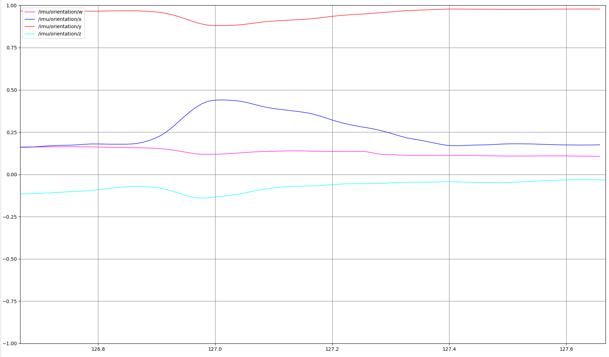
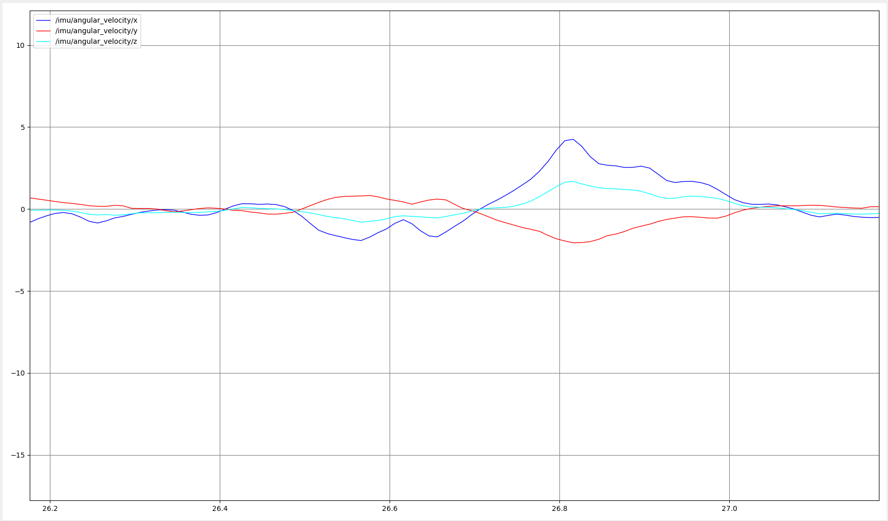
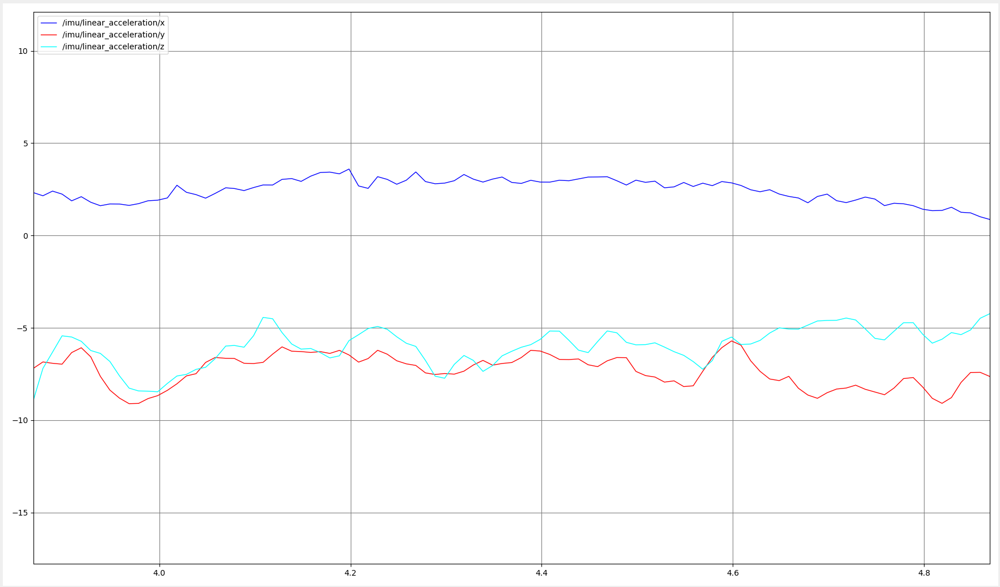
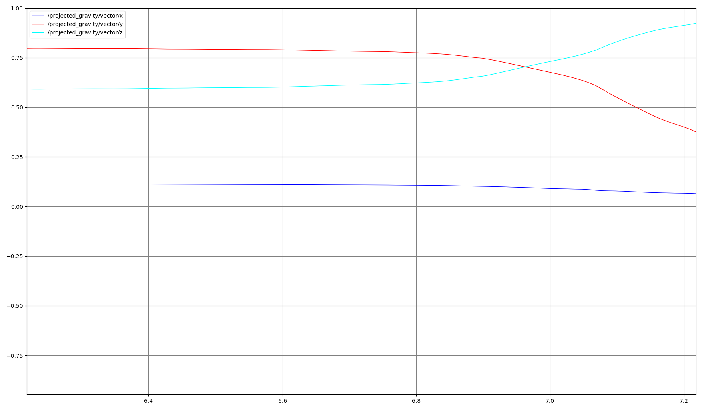

# IMU N100 Test

ROS2 Humble workspace for testing the WHEELTEC N100 IMU

## References

[](https://github.com/RoverRobotics-forks/serial-ros2)
[](https://github.com/NDHANA94/ros2_wheeltec_n100_imu)


## Quick Start

```bash
git clone https://github.com/Humanoid-Project/IMU_N100_Test.git
cd IMU_N100_Test
source /opt/ros/humble/setup.bash
colcon build
source install/setup.bash
```

```bash
# Find the IMU serial port
ls /dev/ttyUSB* /dev/ttyACM*

# Grant read/write permission
sudo chmod 666 /dev/ttyUSB0
```

```bash
# Use the detected port path instead of /dev/ttyUSB0
ros2 run wheeltec_n100_imu imu_node --ros-args -p serial_port:="/dev/ttyUSB0"
```

```bash
# Test
ros2 topic list
ros2 topic echo /imu
```

</br>

## `/imu` Topic

Message type: `sensor_msgs/msg/Imu`

`/imu` is the main topic for the N100 IMU.

```bash
ros2 topic info /imu
ros2 topic info /imu -v
ros2 interface show sensor_msgs/msg/Imu
```

Typical topic info:

```text
Type: sensor_msgs/msg/Imu
Publisher count: 1
Subscription count: 0
```

```text
# ROS timestamp and frame name
header.stamp
header.frame_id

# 3D orientation as quaternion
orientation.x
orientation.y
orientation.z
orientation.w

# Angular velocity in rad/s
angular_velocity.x
angular_velocity.y
angular_velocity.z

# Linear acceleration in m/s^2
linear_acceleration.x
linear_acceleration.y
linear_acceleration.z

# Measurement uncertainty hints
orientation_covariance
angular_velocity_covariance
linear_acceleration_covariance
```

</br>

## Topic Plot

Each launch file starts the IMU node and opens `rqt_plot`.

### 1. Orientation

```bash
ros2 launch imu_gravity orientation_plot.launch.py
```

Plots `/imu/orientation/x`, `/y`, `/z`, and `/w`.



### 2. Angular Velocity

```bash
ros2 launch imu_gravity angular_velocity_plot.launch.py
```

Plots `/imu/angular_velocity/x`, `/y`, and `/z`.



### 3. Linear Acceleration

```bash
ros2 launch imu_gravity linear_acceleration_plot.launch.py
```

Plots `/imu/linear_acceleration/x`, `/y`, and `/z`.



### 4. Projected Gravity

```bash
ros2 launch imu_gravity projected_gravity_plot.launch.py
```

The `imu_gravity` node subscribes to `/imu` and publishes `/projected_gravity`.


